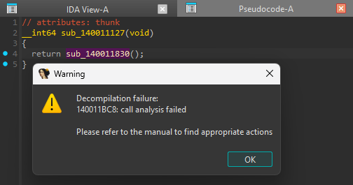
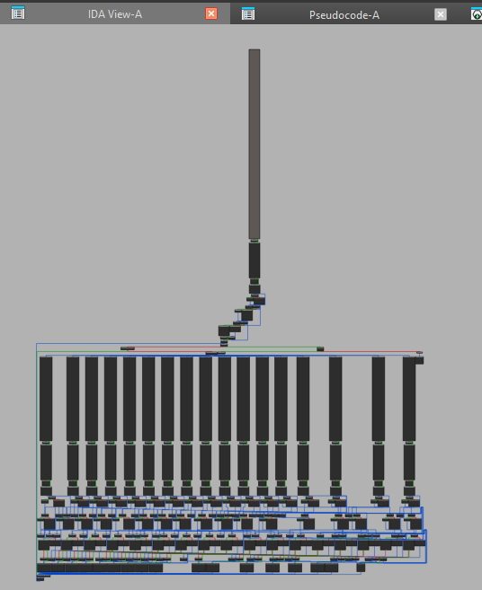
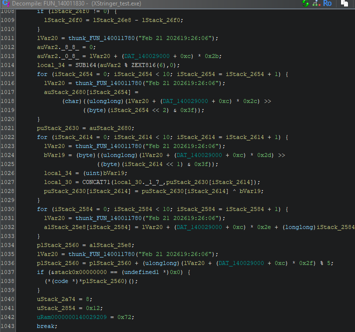
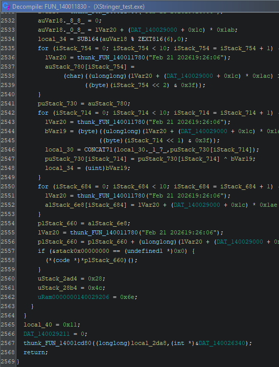
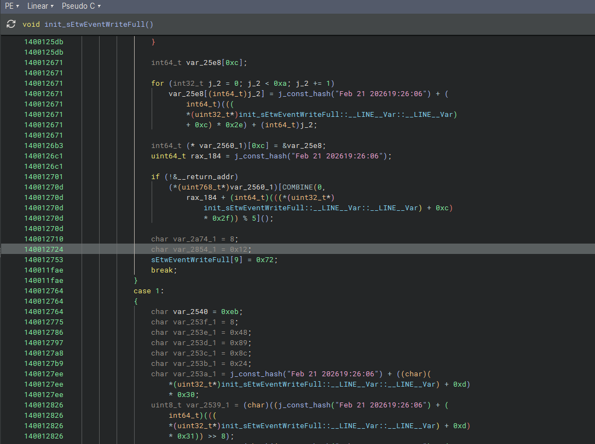
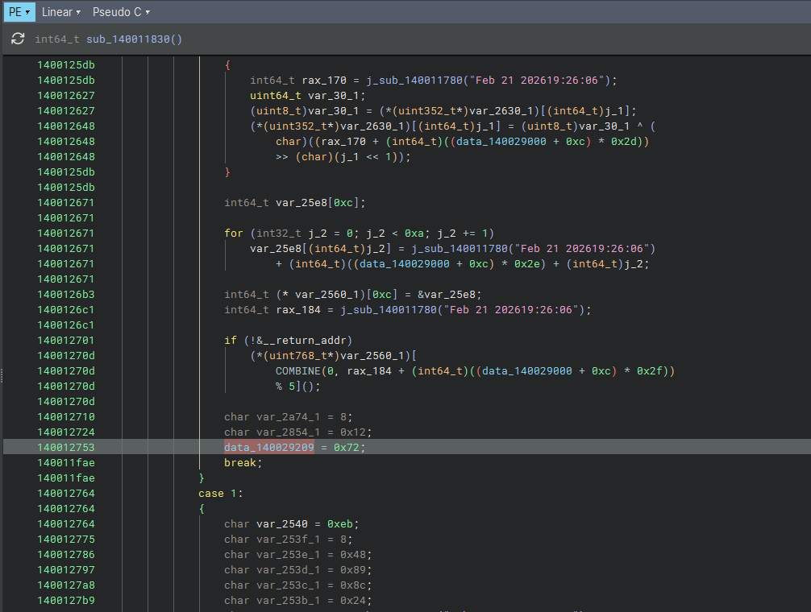

# BRKDEC

**BRKDEC** is a single-header experimental anti-decompilation macro designed to disrupt control-flow and stack analysis in static decompiler pipelines.

A single line:

```cpp
BRKDEC;
```

injects structured noise intended to interfere with:

* Control Flow Graph (CFG) recovery
* Switch/jump table reconstruction
* Stack and return address reasoning
* High-level pseudocode lifting

---

## Effectiveness Overview

The following observations were obtained by compiling a test binary and analyzing it on **Decompiler Explorer (Dogbolt)** across multiple engines.

| Decompiler   | Result                               | Observed Impact |
| :----------- | :----------------------------------- | :-------------- |
| IDA Free     | Target function not decompiled       | Very High       |
| Ghidra       | Severe lifting interpretation issues | High            |
| RecStudio    | Switch reconstruction failure        | Medium–High     |
| RetDec       | Switch reconstruction failure        | Medium–High     |
| Snowman      | Switch reconstruction failure        | Medium–High     |
| Binary Ninja | Partial recovery                     | Moderate        |

### Important Notes

* In several engines, the function itself was recovered, but **switch branch reconstruction failed**, significantly degrading readability and structural understanding.
* Binary Ninja demonstrated stronger resilience compared to others.
* When `BRKDEC` is applied only at the beginning of a function, other functions remain unaffected and decompilable.

These observations reflect empirical testing results and may vary depending on:

* Compiler and optimization level
* Target architecture
* Decompiler version
* Analysis configuration

---

## Decompiler Behavior Examples

### IDA Free

Decompilation of the target function failed entirely.

| | |
|:-|:-|
|  |  |

---

## Ghidra

High-level pseudocode recovery was distorted.
The actual functional instructions appear displaced (e.g., `uRAM[...]` artifacts).

| | |
|:-|:-|
|  |  |

---

## Binary Ninja

Binary Ninja partially recovered switch branches and identified parts of the working logic, though the structure was degraded.

| | |
|:-|:-|
|  |  |

---

## Design Characteristics

BRKDEC combines several lightweight disruption primitives:

* Structured volatile memory artifacts
* Stack and return address noise
* Synthetic switch constructs
* Randomized compile-time constants
* Dead/control-misaligned execution stubs

The goal is not to prevent execution or debugging, but to **degrade static structural reconstruction quality**.

This header does **not**:

* Prevent dynamic analysis
* Stop debugging
* Encrypt code
* Protect against manual reverse engineering

It strictly targets automated high-level lifting and structural recovery.

---

## Usage

Include the header and place `BRKDEC;` at the start of any function:

```cpp
void target() {
    BRKDEC;
    // actual logic
}
```

Minimal integration overhead.
No external dependencies beyond intrinsic access to return address.

---

## Example Source

```
./sample/XStringer_test/XStringer_test.cpp
```

---

## Responsible Disclosure Policy

The automation script used in extended internal experiments (`XStringer.py`) is intentionally not included.

The purpose of this project is:

* Research on decompiler robustness
* Experimental software protection techniques
* Educational analysis of lifting limitations

It is not intended for misuse.

---

## Limitations

* Behavior is compiler-dependent.
* May be optimized away under aggressive settings if not carefully compiled.
* Effectiveness can change with future decompiler updates.
* Primarily validated on x64.

---

## Positioning

BRKDEC should be viewed as:

> A structural perturbation experiment against decompiler lifting pipelines.

It is not a replacement for:

* Virtualization-based obfuscation
* Control-flow flattening frameworks
* Commercial protectors
* Encryption-based loaders