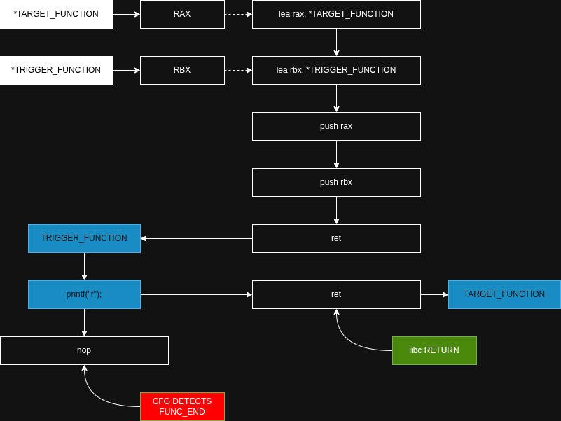
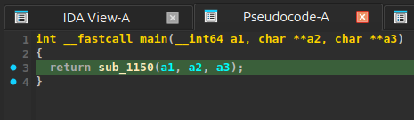
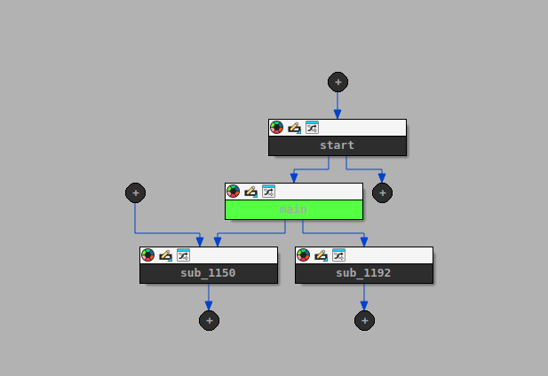
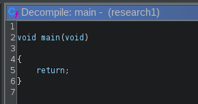
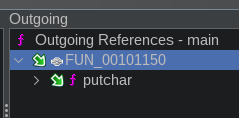
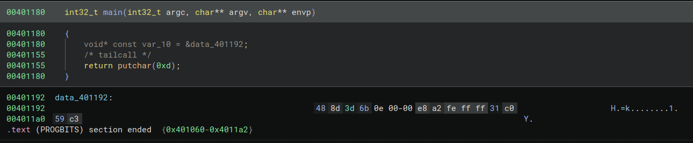

# BRKDEC
Lightweight Anti-Decompiler Library


The concept of this project was derived from prior work:  [android1337/brkida](https://github.com/android1337/brkida)


## Disclaimer
This project and all associated materials are provided **strictly for authorized red teaming and educational and research purposes only.**

This project declares that **it is NOT intended to hinder malware analysis or disrupt DFIR.**


## Executive Summary
BRKDEC is a lightweight anti-decompiler library designed to disrupt static analysis by exploiting fundamental limitations in control flow reconstruction of known commercial decompilers, ultimately to protect sensitive binaries from being reverse engineered.


## Purpose
The ultimate goal of this project is to analyze the decompilation process of commercial decompilers, identify their limitations, and thereby develop anti-decompilation techniques. This project is a research initiative developed to investigate anti-decompilation techniques by combining ideas from [android1337/brkida](https://github.com/android1337/brkida) with an anti-decompilation technique originally studied in the FrontierGuard project (temporary discontinued).


## Scope
The scope of this project covers **binaries written in C or C++** which can be reverse engineered with the following decompilers/reverse engineering toolkits:
* IDA Free
* Ghidra
* Binary Ninja

The outcome of this project will be tested on the binaries for the following operating systems:
* Windows 11
* Windows 10
* Ubuntu Linux

### Out Of Scope
- Packed or self-modifying binaries
- Kernel-mode drivers
- Heavy obfuscation frameworks (e.g., VM-based obfuscation)


## Tools & Environment

### Dev Environment
| Environment           | Information               |
|:----------------------|:--------------------------|
| Operating System      | Ubuntu 24.04.4 LTS        |
| Virtualization Engine | QEMU emulator 8.2.2       |
| Architecture          | Intel x64                 |

### Testing Environment
1. Windows 10 (QEMU virtualized)
2. Ubuntu 24.04 LTS (Acer Laptop)

### Compilers
* Windows Compiler
  * x86_64-w64-mingw32-gcc (GCC) 13-win32
* Ubuntu Compiler
  * Ubuntu clang version 18.1.3 (1ubuntu1)


## Methodology

### Fundamental Concepts & Definitions
Fundamentally, **commercial decompilers often statically reconstruct C or C-like pseudocode from assembly instructions within a binary.** A decompilation process often looks like this:
* Disassembly
  * Translates machine language into assembly language
  * Recovers function boundaries
  * Identifies code sections and data sections
* Control Flow Analysis
  * Analyzes branches (if)
  * Analyzes loops (for/while)
  * Constructs CFG (Control Flow Graph)
* Data Flow Analysis
  * Abstracts variables from registers
  * Analyzes use of stack and heap memory
  * Transforms IR (Intermediate Representation) into SSA (Static Single Assignment) form
* Type Recovery
  * Identifies integers and pointers
  * Reconstructs structures (struct)
  * Infers function parameters and return types
* High-level Reconstruction
  * Converts condition branches (if/else) to C-like pseudocode
  * Converts loops (for/while) to C-like pseudocode
  * Converts function calls to C-like pseudocode
  * Removes or restructures low-level control flow (e.g., goto)
  * Simplifies expressions
* Symbol Recovery
  * Applies debug symbols (if present)
  * Matches known function names (e.g. libraries)

Control Flow Graph (CFG) is **a graph representation of all possible execution paths (flows) within a function, based on branches, loops, and jump instructions.**

Intermediate Representation (IR) is **an abstract representation of code used between source code and machine language** for program analysis and transformation.

Static Single Assignment (SSA) is **a form of code representation in which each variable is assigned exactly once**, enabling precise data flow analysis.

### Techniques & Strategies 
**Commercial decompilers often cannot precisely determine runtime-dependent values** (e.g., return addresses, timestamps, or environment-dependent data). As decompilers heavily rely on the CFG, **conditional branches that depend on runtime values can be exploited to distort CFG reconstruction, resulting in misleading or junk decompiled output.**

### Validation Method
To demonstrate the effectiveness of the outcomes, simple samples written in C and C++ will be divided into two groups: those with BRKDEC applied and those without. First, for a quick inspection, the samples will be uploaded to [Decompiler Explorer](https://dogbolt.org/) to examine the decompilation results, allowing comparison and analysis of the actual decompiled outputs. Second, for a more detailed inspection, IDA Free, Ghidra (+ Cutter), and Binary Ninja will be used to directly compare and analyze the decompilation results.

### Validation Standards
- Pseudocode readability
- Variable recovery accuracy
- Function boundary accuracy

### Validation Assumption
- The compiled binary does not contain debug symbols


## Research

### Function Boundary Obfuscation
Through two days of experimentation, I have observed that when the return adddress is manipulated to cause an abnormal transfer of execution flow between functions, commerical decompilers fail to precisely track the actual execution path.

This technique exploits the assumption made by decompilers that normal call/return operations occur within a function. Typically, a decompiler constructs a CFG on an intra-procedural basis, assuming that each function has an identifiable entry point and a `ret`-based termination/return point.

However, when the return address is manipulated such that a called function (e.g. printf in libc) transfers execution flow to a function other than the original caller, the actual execution flow continues across function boundaries. This creates a discrepancy between the CFG constructed by the decompiler and the actual execution flow, ultimately resulting in a function boundary detection failure.



### Pseudocode Obfuscation

### Variable Obfuscation


## Validation

### Function Boundary

#### IDA Free
```c
/* This file was generated by the Hex-Rays decompiler version 9.3.0.260327.
   Copyright (c) 2007-2025 Hex-Rays <info@hex-rays.com>

   Detected compiler: GNU C++
*/
//----- (0000000000001060) ----------------------------------------------------
// positive sp value has been detected, the output may be wrong!
void __fastcall __noreturn start(__int64 a1, __int64 a2, void (*a3)())
{
    __int64 v3; // rax
    int v4; // esi
    __int64 v5; // [rsp-8h] [rbp-8h] BYREF
    char *retaddr; // [rsp+0h] [rbp+0h] BYREF

    v4 = v5;
    v5 = v3;
    _libc_start_main(main, v4, &retaddr, nullptr, nullptr, a3, &v5);
    __halt();
}

//----- (0000000000001150) ----------------------------------------------------
int sub_1150()
{
    return putchar(13);
}

//----- (0000000000001180) ----------------------------------------------------
int __fastcall main(int a1, char **a2, char **a3)
{
  return sub_1150();
}

//----- (0000000000001192) ----------------------------------------------------
// positive sp value has been detected, the output may be wrong!
__int64 sub_1192()
{
  puts("done!");
  return 0;
}
// 11A1: positive sp value 8 has been found
// 1192: using guessed type __int64 sub_1192();
```

| | |
|-|-|
|  |  |

#### Ghidra
```c
void processEntry entry(undefined8 param_1,undefined8 param_2)

{
    undefined1 auStack_8 [8];
    
    __libc_start_main(FUN_00101180,param_2,&stack0x00000008,0,0,param_1,auStack_8);
    do {
                      // WARNING: Do nothing block with infinite loop
    } while( true );
}

void FUN_00101150(void)

{
    putchar(0xd);
    return;
}

void FUN_00101180(void)

{
    return;
}

```

| | |
|-|-|
|  |  |

#### Binary Ninja
```c
void _start(int64_t arg1, int64_t arg2, void (* arg3)()) __noreturn
{
    int64_t stack_end_1;
    int64_t stack_end = stack_end_1;
    void ubp_av;
    __libc_start_main(main, __return_addr, &ubp_av, nullptr, nullptr, arg3, &stack_end);
    /* no return */
}

int64_t sub_401160()
{
    int64_t (* var_8)() = sub_401171;
    /* tailcall */
    return putchar(0xd);
}

int32_t main(int32_t argc, char** argv, char** envp)
{
    void* const var_10 = &data_401192;
    /* tailcall */
    return putchar(0xd);
}
```




## Limitations


## References
ChatGPT and DeepSeek were used to improve the technical English expressions in this document.

* [https://github.com/android1337/brkida](https://github.com/android1337/brkida)
* [https://en.wikipedia.org/wiki/Disassembler](https://en.wikipedia.org/wiki/Disassembler)
* [https://en.wikipedia.org/wiki/Control-flow_graph](https://en.wikipedia.org/wiki/Control-flow_graph)